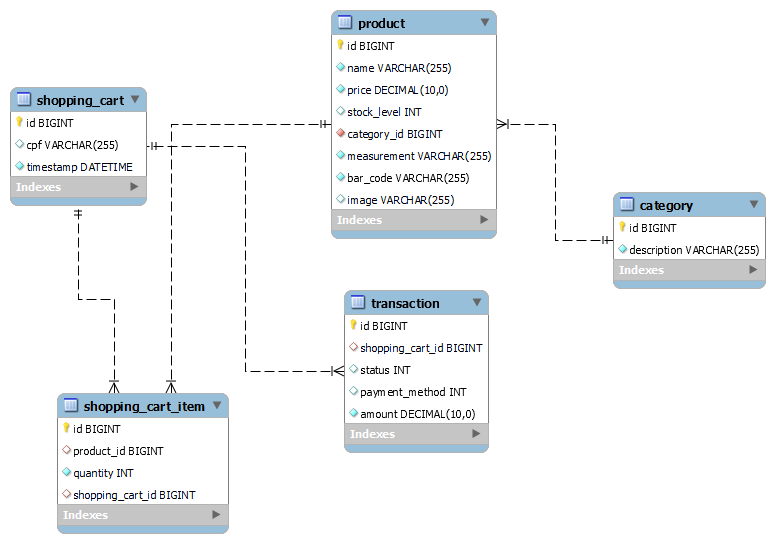

<h1 align="center">API Simuladora de Auto-atendimento - JuMarket</h1>

<p>Uma mercearia do bairro Bom Descanso chamada JuMarket necessita de uma solução para venda de auto-atendimento. Descrição dos requisitos funcionais:</p>

<ul>
<li><h3>Categoria (Category):</h3>
  <ul>
    <li><strong>Criar:</strong>
         <ol>
            <li><strong>Request: </strong><em>description</em></li>
            <li><strong>Response: </strong><em>id, description</em></li>
        </ol>
    </li>
  <li><strong>Editar cadastro:</strong>
    <ol>
      <li><strong>Request: </strong><em>id, description</em></li>
      <li><strong>Response: </strong><em>id, description</em></li>
    </ol>
  </li>  
  <li><strong>Visualizar categorias:</strong>
    <ol>
      <li><strong>Request: </strong> <em>sem request</em></li>
      <li><strong>Response: </strong><em>id, description</em></li>
    </ol> 
  </li>
  <li><strong>Deletar categoria:</strong>
    <ol>
      <li><strong>Request: </strong><em>id</em></li>
      <li><strong>Response: </strong><em>sem response</em></li>
    </ol>
  </li>
  </ul>
  </li>
  <li><h3>Produtos (Product):</h3>
  <ul>
    <li><strong>Criar produto:</strong>
         <ol>
            <li><strong>Request: </strong><em>name, price, stock_level, category_id, measurement, bar_code</em></li>
            <li><strong>Response: </strong><em>id, name, price, stock_level, category_id, measurement, bar_code</em></li>
        </ol>
    </li>
    <li><strong>Listar todos os produtos pela Categoria:</strong>
    <ol>
      <li><strong>Request: </strong><em>category_id</em></li>
      <li><strong>Response: </strong><em>id, name, price, stock_level, category_id, measurement, bar_code</em></li>
    </ol> 
    </li>
    <li><strong>Visualizar produto:</strong>
    <ol>
      <li><strong>Request: </strong><em>id</em></li>
      <li><strong>Response: </strong><em>id, name, price, stock_level, category_id, measurement, bar_code</em></li>
    </ol> 
    </li>
    <li><strong>Deletar produto:</strong>
    <ol>
      <li><strong>Request: </strong><em>id</em></li>
      <li><strong>Response: </strong><em>sem response</em></li>
    </ol> 
    </li>
    <li><strong>Editar produto:</strong>
    <ol>
      <li><strong>Request: </strong><em>id, name, price, stock_level, category_id, measurement</em></li>
      <li><strong>Response: </strong><em>id, name, price, stock_level, category_id, measurement, bar_code</em></li>
    </ol> 
    </li>
  </ul>
  </li>
  <li><h3>Transação (By Checkout):</h3>
  <ul>
    <li><strong>Criar checkout:</strong>
         <ol>
            <li><strong>Request: </strong><em>cpf, items (product_id, quantity)</em></li>
            <li><strong>Response: </strong><em>id, shopping_cart_id, status, payment_method, amount</em></li>
        </ol>
    </li>
    <li><strong>Cancelar checkout:</strong>
         <ol>
            <li><strong>Request: </strong><em>id</em></li>
            <li><strong>Response: </strong><em>HttpResponse</em></li>
        </ol>
    </li>
    <li><strong>Finalizar transação:</strong>
         <ol>
            <li><strong>Request: </strong><em>id, payment_method</em></li>
            <li><strong>Response: </strong><em>HttpResponse</em></li>
        </ol>
    </li>

</ul>
<figure>
<p align="center">
  <br>
  Diagrama UML Simplificado de uma API API Simuladora de Auto-atendimento
</p>
</figure>

<h2>💻 Configuração</h2>

<table align="center">
	<td>Linguagem</td>
	<td>Kotlin</td>
</tr>
<tr>
	<td>Framework</td>
	<td>Spring Boot</td>
</tr>
<tr>
	<td>Build Tool</td>
	<td>Gradle</td>
</tr>
<tr>
	<td>Banco de Dados</td>
	<td>MySQL</td>
</tr>
<tr>
	<td>Java Version</td>
	<td>17</td>
</tr>
</table>

<h2>🚀 Excecução do projeto</h2>

Para executar o projeto via Docker, na pasta raiz do projeto, efetue o seguinte comando:

```
docker-compose -f database.yml up 
```
Com a aplicação em pé, clique neste link: <a href="[http://localhost:8083/swagger-ui/index.html#/]">http://localhost:8083/swagger-ui/index.html#</a>
<hr>
<a href = "mailto:contatodeboravicente@gmail.com"></a>
<a href="https://www.linkedin.com/in/deborasilvadlvs" target="_blank"></a> 
